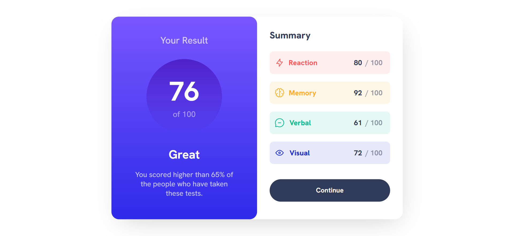

# Frontend Mentor - Results summary component solution

This is a solution to the [Results summary component challenge on Frontend Mentor](https://www.frontendmentor.io/challenges/results-summary-component-CE_K6s0maV). Frontend Mentor challenges help you improve your coding skills by building realistic projects. 

## Table of contents

- [Frontend Mentor - Results summary component solution](#frontend-mentor---results-summary-component-solution)
  - [Table of contents](#table-of-contents)
  - [Overview](#overview)
    - [The challenge](#the-challenge)
    - [Screenshot](#screenshot)
    - [Links](#links)
  - [My process](#my-process)
    - [Built with](#built-with)
    - [What I learned](#what-i-learned)
    - [Continued development](#continued-development)
  - [Author](#author)

**Note: Delete this note and update the table of contents based on what sections you keep.**

## Overview

### The challenge

Users should be able to:

- View the optimal layout for the interface depending on their device's screen size
- See hover and focus states for all interactive elements on the page

### Screenshot

### Links

- Solution URL: [Solution on Github](https://github.com/Mueen-Alkhous/result-summary-card)
- Live Site URL: [Result Summary Component](https://mueen-alkhous.github.io/result-summary-card/)

## My process

### Built with

- HTML5 markup
- CSS custom properties
- Flexbox
- Desktop-first workflow

### What I learned

Working on this project helped me discover and learn new things like:

- Using @font-face in CSS.
- What is Variable fonts and how it works.
- Working with local fonts

also this project made me use responsive consepts for the first time and reinforce what i've learn about responsive consepts, and ofcourse improved my HTML and CSS skills.
It was really a challeng for me to make this component, but it is only a single step in my journey to become a Fron-end Dev.

### Continued development

I think I need to improve my skills on responsive desgin, structuring my HTML better, and my overall CSS skills.

## Author

- Frontend Mentor - [@Mueen-Alkhous](https://www.frontendmentor.io/profile/Mueen-Alkhous)
- Github - [Mueen Alkhous](https://github.com/Mueen-Alkhous)

